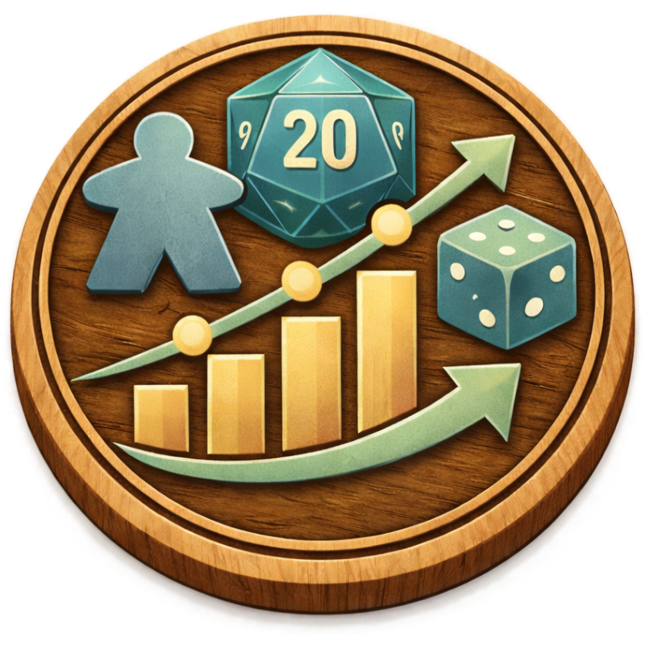

<p align="center">
  
</p>

# ludometrics 🎲

Machine learning models that predict board game success from board game data

## Preamble

Based on a [dataset](https://www.kaggle.com/datasets/threnjen/board-games-database-from-boardgamegeek) of 22k board games. I plan to predict the _chance of succeeding_ a board game has based on its _feature profile_.

A secondary _development viability_ score — computed on demand from mechanic and theme clusters — estimates how feasible a game concept is to build on a mixed reality platform like Apple Vision Pro. The end goal is a tool that helps determine what kind of board game to build for the highest chance of success on that platform.

A _feature profile_ consists of: mechanics, complexity, categories & subcategories, themes, playtime (manufacturer stated + community min/max), min/max players, and recommended age.

The _chance of succeeding_ is split into two independent scores:

- **Quality score** — how well-regarded is the game among players who played it (`BayesAvgRating`, Bayesian-corrected for low vote counts)
- **Commercial score** — how commercially successful is the game, time-normalised by years on market (`NumOwned / clamp(years_on_market, 1, 10)`, log-compressed)

_Development viability_ will (subjectively) depend on:

- mechanics (will need to label each mechanic with a development viability rating)
- complexity (simpler is more viable)
- category and subcategories (will need to label each category with a development viability rating)
- playtime (2+ hour long sessions might not be optimal for AR)
- recommended age (under 14 years old is out of scope for target AR market)

## Plan

- [Pipeline](plan/pipeline.md)

## Scripts

### Setup

If you don't have `uv`, install it with `curl -LsSf https://astral.sh/uv/install.sh | sh`.

```sh
uv sync
```

**macOS only:** LightGBM requires `libomp` (OpenMP), which is not bundled in its Python wheel and must be installed separately:

```sh
brew install libomp
```

### Run tests

```sh
uv run pytest
```

### Training notebooks

Each notebook trains one algorithm against both targets and saves models + a report to `models/<algorithm>/`.

```sh
# Open interactively
uv run euporie-notebook notebooks/01_linear_regression.ipynb

# Run all four headlessly (saves outputs into each notebook's JSON)
uv run run-notebooks

# Run for a specific split ratio
uv run run-notebooks --split 70_30
```

### Combine reports

Discovers all `models/*/report_*.md` files across every split and algorithm, and writes a single comparison table to `results/comparison.md`.

```sh
uv run combine-reports
```

### Preprocessing

```sh
uv run euporie-notebook notebooks/00_notebooks/00_preprocessing.ipynb
```

## TODO

- [x] Verify BGG Bayesian average formula (first section of `notebooks/00_preprocessing.ipynb`)
- [x] Pre-process dataset (`notebooks/00_preprocessing.ipynb`)
- [x] Train prediction models (`quality_score`, `commercial_score`)
- [ ] Cluster mechanics and themes (Louvain / k-means)
- [ ] Label mechanics and themes with development viability weights
- [ ] Build HTML interface
